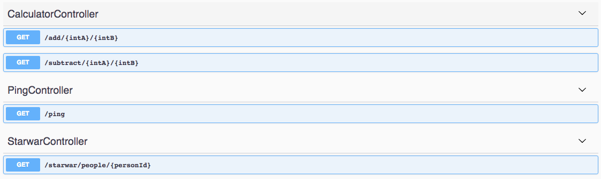

# loopback4-external-apis

Example repo to show how to call other services using [LoopBack 4](v4.loopback.io).
Detailed instruction can be found:
https://loopback.io/doc/en/lb4/Calling-other-APIs-and-web-services.html

## What's in this LoopBack 4 project

This LoopBack 4 application contains endpoints:

- connecting to a SOAP service endpoint for a calculator service
- connecting to a REST service endpoint for Star War related info

## Run the application

1. Run:
   `npm start`
2. In a browser, go to:
   `http://localhost:3000/explorer`

[-@2x.png>)](http://loopback.io/)
